# myruntime — Design

A from-scratch Linux container runtime in Go, built on the standard library
alone — no `runc`/`libcontainer`, no `vishvananda/netlink`, no `systemd`. It
implements the isolation primitives (namespaces, cgroups v2, `pivot_root`)
directly so the mechanism is visible rather than hidden behind a dependency.

This document explains what it is, what it deliberately is not, **what
actually runs today versus what is still scaffolded**, how it fails, and the
trade-offs that shaped it. For the rationale behind specific decisions, see
the ADRs in [decisions/](decisions/). For the gaps an attacker would exploit,
see the [threat model](threat-model.md). For the intended end-state component
graph, see [ARCHITECTURE.md](ARCHITECTURE.md).

## Problem

Understanding how containers actually work means building the Linux isolation
primitives yourself instead of treating Docker as a black box. The goal here
is pedagogical: implement namespace isolation, cgroup v2 resource limits,
`pivot_root`, image pulls, and bridge networking from raw syscalls and sysfs
writes — using **only the Go standard library**, which forces hand-rolled
netlink messages and direct file I/O against `/sys/fs/cgroup` and `/proc`
rather than a library call. Every unimplemented gap is tied to a milestone via
`TODO(Mx.y)` markers in the code.

## Goals

- **Isolate a process with all six Linux namespaces** (USER, PID, MNT, UTS,
  IPC, NET) created together in a single clone via the re-exec pattern
  ([internal/namespace/namespace.go:20-23](../internal/namespace/namespace.go#L20-L23),
  [ADR-001](decisions/ADR-001-reexec-init.md)).
- **Cap resources with cgroup v2** limits (`cpu.max`, `memory.max`,
  `pids.max`) written directly to the unified hierarchy
  ([internal/cgroup/manager.go](../internal/cgroup/manager.go), [ADR-002](decisions/ADR-002-cgroup-v2-only.md)).
- **Strong filesystem isolation via `pivot_root(2)`** with mount-propagation
  containment, not `chroot`
  ([internal/filesystem/mounts.go:27-74](../internal/filesystem/mounts.go#L27-L74), [ADR-003](decisions/ADR-003-pivot-root-vs-chroot.md)).
- **Stay stdlib-only**: zero third-party Go dependencies — demonstrated by
  hand-rolled rtnetlink for loopback bring-up
  ([ADR-004](decisions/ADR-004-raw-rtnetlink.md); `go.mod` has no `require` block).
- **Keep every gap traceable** to a milestone via `TODO(Mx.y)` markers.
- **Centralize the cross-package contract** in `pkg/specs` so internal
  packages share vocabulary without circular dependencies
  ([pkg/specs/config.go](../pkg/specs/config.go)).

## Non-goals

Being explicit about these — "we didn't build X" is a deliberate choice, not a
missing feature.

- **Not OCI-compliant or production-grade.** No seccomp, no AppArmor/SELinux,
  no capability dropping — see [threat model](threat-model.md).
- **Not cgroup v1 / hybrid.** v2 unified hierarchy only; the host must boot
  with `systemd.unified_cgroup_hierarchy=1` ([ADR-002](decisions/ADR-002-cgroup-v2-only.md)).
- **Not multi-platform.** Linux-only, kernel 5.8+. macOS/Windows use the
  `Vagrantfile` or a privileged dev container.
- **Not a daemon.** A CLI binary with on-disk JSON state, not a long-running
  server with an API ([ADR-005](decisions/ADR-005-json-state-files.md)).
- **No netlink/iproute2 dependency.** Implemented paths hand-roll rtnetlink;
  no shelling out to `ip(8)` ([ADR-004](decisions/ADR-004-raw-rtnetlink.md)).
- **Not concurrency-hardened.** The cgroup `Manager` and the store take no
  locks; single-threaded, caller-synchronized use is assumed.

## Status — what runs vs. what is scaffolded

This is a milestone project mid-build. The **isolation primitives are real and
tested**; the **end-to-end container lifecycle is still scaffolding**. The only
executable path today is `myruntime run` (parent) → `init` (child); every other
subcommand prints `command not yet implemented`
([cmd/myruntime/main.go:141-144](../cmd/myruntime/main.go#L141-L144)).

| Component | State | Evidence |
|---|---|---|
| Six-namespace isolation (`CLONE_NEW*`) | ✅ implemented | [namespace.go:20-23](../internal/namespace/namespace.go#L20-L23); wired at [main.go:120,133](../cmd/myruntime/main.go#L120) |
| UTS hostname (`sethostname`) | ✅ implemented | [namespace.go:27-35](../internal/namespace/namespace.go#L27-L35) |
| Loopback bring-up (raw rtnetlink) | ✅ implemented | [namespace.go:39-106](../internal/namespace/namespace.go#L39-L106) |
| `pivot_root` + `/proc` mount | ✅ implemented | [mounts.go:27-89](../internal/filesystem/mounts.go#L27-L89) |
| cgroup v2 CPU/memory/PID limits | ✅ implemented (off the live path) | [manager.go](../internal/cgroup/manager.go); `TestCPULimit` |
| `pkg/specs` contract types | ✅ implemented | [config.go](../pkg/specs/config.go) |
| **User-namespace UID/GID remap** | ⚠️ **implemented but not wired** | [userns.go:28-89](../internal/namespace/userns.go#L28-L89) is unit-tested, but `run` sets `CLONE_NEWUSER` and never calls `WriteIDMappings` ([main.go:93-139](../cmd/myruntime/main.go#L93-L139)) |
| `io.max` limit + full cgroup stats | 🚧 partial | `io.max` is `TODO(M2.5)`; `stats.go` readers are unused stubs |
| `/sys` (ro), `/tmp`, `/dev` device nodes | 🚧 planned | `MountSys`/`MountTmpfs` are `TODO(M3.3)` stubs ([mounts.go:93-102](../internal/filesystem/mounts.go#L93-L102)) |
| OverlayFS + layer store | 🚧 planned | stubs returning `nil` ([overlay.go](../internal/filesystem/overlay.go)) |
| Image pull / store / unpack | 🚧 planned | stubs ([internal/image/](../internal/image/)) |
| Bridge / veth / IPAM / NAT | 🚧 planned | stubs ([internal/network/](../internal/network/)) |
| `container.Runtime` lifecycle | 🚧 planned | every method returns `nil`, `TODO(M5.x)` ([lifecycle.go:21-93](../internal/container/lifecycle.go#L21-L93)) |
| State persistence (JSON on disk) | 🚧 planned | stubs ([store/state.go](../internal/store/state.go)) |
| `exec` (setns), PID-1 reaper/signals | 🚧 planned | `JoinNamespaces`, `StartReaper`, `ForwardSignals` are stubs |
| CLI commands beyond `run`/`init` | 🚧 planned | default branch prints "not yet implemented" |

Two consequences worth stating plainly, because a reviewer running the binary
will hit them:

1. **A container started via `myruntime run` is not rootless and not
   resource-limited.** The user namespace is created but unmapped, and no
   cgroup is attached on the live path — see [Known limitations](#known-limitations).
2. **The container filesystem is `rootfs` + `/proc` only.** No `/dev/null`,
   `/dev/urandom`, `/sys`, or `/tmp` yet, so most real userland won't run.

## Architecture

The intended design routes everything through a central `container.Runtime`
that owns the subsystem packages (`namespace`, `cgroup`, `filesystem`, `image`,
`network`, `store`), all sharing the `pkg/specs` contract layer with strictly
downward, acyclic dependencies (see [ARCHITECTURE.md](ARCHITECTURE.md)). **That
orchestration is not built yet.**

What is live today is the CLI's `run`/`init` pair, which performs container
setup *without* going through `Runtime` at all:

- **`run` (parent)** —
  [cmd/myruntime/main.go:93-139](../cmd/myruntime/main.go#L93-L139). Builds the
  combined namespace flag set (`namespace.CloneFlags`), constructs an `init`
  argv, and runs `exec.Command("/proc/self/exe", initArgs)` with
  `SysProcAttr.Cloneflags` set. The re-exec — rather than calling `clone()`
  inline — is required because the Go runtime is multi-threaded and namespace
  creation must happen on a fresh single-threaded process ([ADR-001](decisions/ADR-001-reexec-init.md)).
- **`init` (child)** —
  [cmd/myruntime/main.go:42-91](../cmd/myruntime/main.go#L42-L91). Now inside
  the new namespaces, it runs `filesystem.SetupContainerMounts` (`pivot_root`
  + `/proc`), `namespace.SetupHostname`, `namespace.SetupLoopback` (raw
  rtnetlink), then `syscall.Exec`s the entrypoint, which becomes PID 1.

No `Runtime`, no cgroup attachment, no UID-map write, no image/overlay/network,
and no state file are involved in the live path. The `cgroup` package is fully
implemented but is invoked by nothing on that path.

## Failure modes

| Failure | Detection | Recovery | Impact |
|---|---|---|---|
| `run` sets `CLONE_NEWUSER` but writes no UID/GID map | IDs inside appear as `nobody` (kernel overflow id); files owned by `nobody` | None on the live path — `WriteIDMappings` exists but is never called from `run` | The documented rootless guarantee is **not delivered**; see [threat model EP-1](threat-model.md) |
| Entrypoint runs with no cgroup on the live path | Process absent from `/sys/fs/cgroup/myruntime/<id>/cgroup.procs` | None — `run` bypasses `Runtime`, so `AddProcess` is never called | A `run` container can exhaust host CPU/memory/PIDs ([threat model D-1](threat-model.md)) |
| `pivot_root` fails partway | `PivotRoot` returns a wrapped error; `init` prints to stderr and exits 1 | No rollback — prior steps (private root, self-bind, `putOld`) are not reversed | Acceptable: the throwaway namespaces die with the child ([mounts.go:43-71](../internal/filesystem/mounts.go#L43-L71)) |
| Child `init` fails (mount/hostname/loopback/exec) | Child writes a context-prefixed message and exits 1; parent sees non-zero exit | Parent surfaces the stderr string and exits 1; no cleanup | Coarse error reporting, no structured codes ([main.go:136-139](../cmd/myruntime/main.go#L136-L139)) |
| PID 1 has no reaper / signal forwarder | Orphaned grandchildren become un-reaped zombies; SIGTERM not forwarded | None — `StartReaper`/`ForwardSignals` are stubs; the entrypoint is exec'd directly as PID 1 | Long-lived workloads accumulate zombies; no graceful stop ([init.go:42-52](../internal/container/init.go#L42-L52)) |
| cgroup `Destroy` on a cgroup with live processes | `Destroy` reads `cgroup.procs`; refuses if non-empty | Safe refusal — directory left intact, caller must stop processes and retry | Correct conservative behavior ([manager.go:101-118](../internal/cgroup/manager.go#L101-L118)) |
| `NewManager` controller-enable errors | Errors from `subtree_control` writes are ignored (`_ =`) | A `Manager` can return with no controllers enabled; later limit writes then fail | Silent degradation; the `m == nil` guard avoids panics ([manager.go:31-40](../internal/cgroup/manager.go#L31-L40)) |
| Raw-netlink ACK read has no timeout | — | `SetupLoopback` blocks indefinitely if the kernel never ACKs | Hang rather than error on a pathological kernel ([namespace.go:113-152](../internal/namespace/namespace.go#L113-L152)) |
| Stub subsystem returns `nil` (success) doing nothing | `OverlayFS.Mount`, `ContainerStore.Save`, `CreateBridge`, … return `nil` | N/A — the live path doesn't call them | **Footgun:** naive future wiring would "succeed" with no side effect (e.g. fall through to the host FS when an overlay was expected) |

## Security

The runtime is privileged (root / `CAP_SYS_ADMIN` for `clone` with namespaces,
`pivot_root`, mounts, sysfs and netlink writes). The trust boundary sits
between the container's isolated process tree and the host kernel, filesystem,
network, and the runtime process itself. The **shared host kernel is the
ultimate boundary** — namespaces and cgroups are kernel features, so a kernel
exploit from the container crosses everything.

The intended primary privilege boundary is the user namespace, but on the
wired-up CLI path it is created without UID maps, weakening it. Full STRIDE
analysis, with the implemented vs. gap status of each threat, is in the
[threat model](threat-model.md).

## Trade-offs (full rationale in ADRs)

| Choice | We picked | We rejected | Why |
|---|---|---|---|
| Entering namespaces | Re-exec `/proc/self/exe` with `init` | Direct `clone()`/`unshare()` from the live runtime | [ADR-001](decisions/ADR-001-reexec-init.md) |
| Resource-limit backend | cgroup v2, direct sysfs writes | cgroup v1/hybrid, or systemd delegation | [ADR-002](decisions/ADR-002-cgroup-v2-only.md) |
| Root-filesystem swap | `pivot_root(2)` + propagation containment | `chroot()` | [ADR-003](decisions/ADR-003-pivot-root-vs-chroot.md) |
| Interface configuration | Hand-rolled raw rtnetlink | `vishvananda/netlink` or `ip(8)` | [ADR-004](decisions/ADR-004-raw-rtnetlink.md) |
| State persistence | Per-container JSON files | Embedded DB / etcd / memory-only | [ADR-005](decisions/ADR-005-json-state-files.md) |
| Namespace selection | All six, always (config ignored) | Phased/configurable namespaces | [ADR-006](decisions/ADR-006-all-namespaces-combined.md) |

## Known limitations

Real and deliberate, listed here so reviewers don't have to find them by
reading the code.

- **User namespace is enabled but unmapped on the live path.** `run` sets
  `CLONE_NEWUSER` but never calls `namespace.WriteIDMappings`
  ([main.go:93-139](../cmd/myruntime/main.go#L93-L139) vs.
  [userns.go:47-89](../internal/namespace/userns.go#L47-L89)) — so the
  implemented `0→100000` remapping, the central privilege-escalation mitigation,
  is not actually applied when you run a container.
- **The `container.Runtime` lifecycle is stubbed.** `run` bypasses it, so there
  is no cgroup attachment, overlay, networking, or state file on the only
  executable path ([lifecycle.go:21-93](../internal/container/lifecycle.go#L21-L93)).
- **cgroup limits are off the live path.** The subsystem is correct and tested
  but `run` neither creates a cgroup nor calls `AddProcess`.
- **No capability dropping, seccomp, AppArmor/SELinux, or `/proc`-`/sys`
  masking.** The entrypoint inherits the parent's capabilities; `/sys` is never
  mounted read-only ([threat model EP-3, I-1](threat-model.md)).
- **PID 1 doesn't reap zombies or forward signals** ([init.go:42-52](../internal/container/init.go#L42-L52)).
- **Image, overlay, and networking are type-contract skeletons** — no
  end-to-end container-from-image flow exists.
- **Untrusted image-tar extraction (planned) has no path-traversal or
  size-bomb defense** and would run as root ([threat model T-3, D-3](threat-model.md)).
- **State persistence is stubbed and not symlink-safe**; the documented
  write-then-rename + fsync atomicity is not coded.
- **`GenerateID` returns an empty string** ([container.go:38-41](../internal/container/container.go#L38-L41)),
  so until M5.2 all containers would collide at the same path.
- **No concurrency control** in the cgroup `Manager` — concurrent
  create/destroy on one ID can race.

## See also

- [ARCHITECTURE.md](ARCHITECTURE.md) — the intended end-state component graph
  and dependency rules (note: describes the *designed* lifecycle, much of which
  is still stubbed per the status table above).
- [decisions/](decisions/) — the ADRs behind the trade-offs table.
- [threat-model.md](threat-model.md) — STRIDE analysis and the trust-boundary
  diagram.
