# myruntime — Threat model (STRIDE-lite)

This is a learning runtime, not a production one. The threats below are real —
listed so reviewers don't have to find them by reading the code, and so the
hardening work (capabilities, seccomp, image-tar safety, mTLS-for-registry) has
a clear scope. Each entry is marked with its **as-built** status, which is not
always what the design intends.

## Scope

In scope:

- A single privileged host running the `myruntime` CLI as root.
- One container: the entrypoint process isolated in six namespaces with a
  pivoted root filesystem.
- The on-disk artifacts the runtime owns: cgroup files under
  `/sys/fs/cgroup/myruntime/`, `/proc/<pid>/{uid_map,gid_map}`, the (planned)
  image/layer store, and (planned) `state.json` files.

Out of scope:

- Multi-tenant orchestration, an API/daemon, secret management.
- Confidentiality of data at rest (images and state are plaintext on disk).
- Kernel vulnerabilities themselves (see "What is *not* a threat").

## Assets

| Asset | Where | Why it matters |
|---|---|---|
| Host root / kernel integrity | The host the runtime runs on | The runtime is privileged; a container escape means host compromise |
| The isolation boundary | Namespaces + cgroup + pivoted root | The product — if it leaks, the container sees or affects the host |
| Container resource budget | `/sys/fs/cgroup/myruntime/<id>/*` | An unbounded container can DoS the host |
| Container state records (planned) | `<root>/<id>/state.json` | The runtime trusts these for stop/kill/cleanup; a forged record misdirects privileged operations |

## Trust boundaries

Everything inside the **Host** box is trusted code we wrote and privileged
files we own. The **Container** box is untrusted: the entrypoint and any image
content are treated as hostile. The **shared host kernel** sits under both — it
is the ultimate boundary, because namespaces and cgroups are kernel features, so
a kernel exploit from inside the container bypasses every control above it.

The intended **primary privilege boundary is the user namespace**. It is drawn
dashed because, on the live CLI path, the UID/GID map that gives it teeth is
never written.

## Threats (STRIDE-lite)

| # | STRIDE | Threat | Status | Detail |
|---|---|---|---|---|
| EP-1 | **E**oP | Container root (UID 0) **equals host root** if the user namespace has no UID/GID map | **Open (critical)** | `userns.go` implements the `0→100000` map with `setgroups`-deny ordering and is unit-tested, but the live `run`/`init` path sets `CLONE_NEWUSER` **without** calling `WriteIDMappings` ([userns.go:28-89](../internal/namespace/userns.go#L28-L89) vs [main.go:93-139](../cmd/myruntime/main.go#L93-L139)). The promised rootless isolation is not delivered on the only executable path. Fix is mechanical (write maps from parent after fork, before exec). |
| EP-2 | **E**oP | `chroot`-style escape via fds open to the old root | **Mitigated** | `pivot_root` fully detaches and `MNT_DETACH`-unmounts the old root, then removes `/.pivot_root` ([mounts.go:27-74](../internal/filesystem/mounts.go#L27-L74), [ADR-003](decisions/ADR-003-pivot-root-vs-chroot.md)). |
| EP-3 | **E**oP | No capability dropping, seccomp, or LSM — entrypoint inherits all caps the parent holds | **Open** | No `capset`/seccomp/AppArmor anywhere; `init` execs the entrypoint with inherited capabilities ([main.go:87-91](../cmd/myruntime/main.go#L87-L91)). |
| EP-4 | **E**oP | `ip_forward` (and planned MASQUERADE) enabled host-wide on bridge setup, never reset | **Open (planned code)** | Intended `CreateBridge` writes `1` to `/proc/sys/net/ipv4/ip_forward`; `DeleteBridge` has no reset and no prior-state tracking — currently all stubbed ([bridge.go:22-46](../internal/network/bridge.go#L22-L46)). |
| T-1 | **T**ampering | Mounts inside the container propagate back to the host mount table | **Mitigated** | `MS_REC \| MS_PRIVATE` applied to `/` before `pivot_root`; guarded by `TestHostMountsUnaffected` ([mounts.go:43](../internal/filesystem/mounts.go#L43)). |
| T-2 | **T**ampering | Malicious container ID redirects cgroup writes outside the hierarchy (path traversal) | **Mitigated** | `validateContainerID` rejects empty/absolute/`.`/`..`/separator IDs before any I/O; tested with `../escape` ([manager.go:265-286](../internal/cgroup/manager.go#L265-L286)). |
| T-3 | **T**ampering | Malicious image tar with `../` entries writes to host files during unpack as root | **Open (planned code)** | `ExtractTarGz`/`UnpackLayers` are stubs with no entry-name validation and no setuid stripping ([internal/image/unpack.go](../internal/image/unpack.go)). Must be closed before image pull ships. |
| T-4 | **T**ampering | `state.json` is unauthenticated; an attacker edits `RootFS`/`CgroupPath` to misdirect cleanup (e.g. unmount the wrong path) | **Open (planned code)** | No checksum/ownership check and no symlink-safe write; the store is stubbed ([state.go:25-47](../internal/store/state.go#L25-L47), [ADR-005](decisions/ADR-005-json-state-files.md)). |
| I-1 | **I**nfo | Container reads host process list / kernel info via `/proc`, `/sys` | **Partial** | A fresh procfs is mounted in the PID namespace (good), but sensitive files aren't masked and `/sys` is not mounted read-only — `MountSys` is a `TODO(M3.3)` stub ([mounts.go:79-96](../internal/filesystem/mounts.go#L79-L96)). |
| I-2 | **I**nfo | Registry bearer token leaked via logs/errors during pull | **Open (planned code)** | `authenticate`/`getBlob` are stubs; no token-sanitization discipline defined ([registry.go:34-58](../internal/image/registry.go#L34-L58)). |
| D-1 | **D**oS | Container exhausts host CPU/memory/PIDs because limits are off the live path | **Partial** | cgroup `Create`/`AddProcess` fully implement CPU/memory/PID limits and `TestCPULimit` proves throttling, but the `run` path never creates a cgroup or adds the PID ([manager.go:44-91](../internal/cgroup/manager.go#L44-L91) vs [main.go:93-139](../cmd/myruntime/main.go#L93-L139)). `io.max` is also a stub. |
| D-2 | **D**oS | OOM kill sends SIGKILL with no graceful handling or notification | **Open** | `OOMKillCount` can be read after the fact, but there is no OOM handler or pre-OOM eviction ([manager.go:239-255](../internal/cgroup/manager.go#L239-L255)). |
| D-3 | **D**oS | Image zip-bomb fills host disk; orphaned veth/IP/iptables leak on crash | **Open (planned code)** | No uncompressed-size cap in (stub) unpack; planned reconciliation only cleans cgroups, not network resources or upper layers ([exec.go `ReconcileOnStartup`](../internal/container/exec.go)). |
| S-1 | **S**poofing | Container sets an arbitrary hostname (e.g. `prod-db`) to confuse host-side monitoring | **Partial** | The UTS namespace scopes the hostname to the container so the host is unaffected, but there is no hostname validation ([namespace.go:27-35](../internal/namespace/namespace.go#L27-L35)). |
| R-1 | **R**epudiation | No audit log of privileged operations (maps written, mounts, signals, cgroup changes) | **Open** | No logging subsystem; errors go to stderr only. |

## What is *not* a threat (and why)

- **A fork bomb in the container's own PID namespace** is not a *host* threat:
  `CLONE_NEWPID` isolates the PID tree, and `pids.max` (when applied via the
  cgroup package) caps process count. The namespace already prevents the host's
  PID space from being exhausted ([namespace.go:22](../internal/namespace/namespace.go#L22),
  [manager.go:257-263](../internal/cgroup/manager.go#L257-L263)).
- **Reading `/proc/<pid>/uid_map`** to learn the `0→100000` scheme is not a
  meaningful disclosure — `uid_map` is intentionally world-readable and the
  mapping is not a secret.
- **A SHA-256 collision in the (planned) content-addressable layer store** is
  not a realistic tampering vector — it is cryptographically infeasible. The
  real layer-store risk is on-disk integrity (T-3/T-4), not digest collision.
- **Concurrent `Create`/`Destroy` races in the cgroup `Manager`** are a
  correctness bug, not a privilege-boundary crossing: they can corrupt one
  runtime's own bookkeeping but do not let a container cross the boundary
  ([manager.go](../internal/cgroup/manager.go), no mutex).

## What hardening will fix

In rough priority order — note the first item is the highest-leverage fix in
the project:

1. **Write the UID/GID maps on the `run` path** (closes EP-1). The code exists
   in `userns.go`; it needs the parent↔child plumbing from [ADR-001](decisions/ADR-001-reexec-init.md).
2. **Drop capabilities + add a seccomp profile** before `exec` (closes EP-3).
3. **Safe image-tar extraction** — reject `../` entries, strip setuid, cap
   uncompressed size (closes T-3, part of D-3).
4. **Read-only `/sys`, masked `/proc` paths, `/dev` device nodes** (closes I-1,
   makes the container filesystem usable).
5. **Symlink-safe, checksummed state writes** (closes T-4).
6. **Reset `ip_forward` and track network resources for cleanup** (closes EP-4,
   part of D-3).

Audit logging (R-1), OOM handling (D-2), and registry token hygiene (I-2) are
tracked but lower priority and noted here so they are not silently forgotten.
